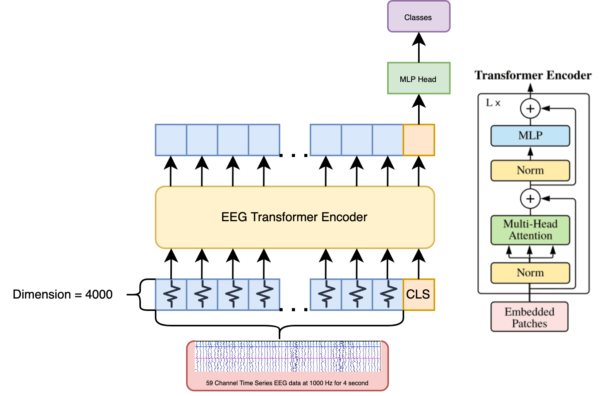

# EEG-Transformer
A ViT based transformer applied on multi-channel time-series EEG data for motor imagery classification. This repo is part of the final project for COGS 189: Brain Computer Interfaces at the University of California, San Diego, Winter 2022. This code repository and the project is managed and developed by Colin Wang, and several possible directions to improve the baseline model are proposed by Xing Hong, Luning Yang, Annie Fan, Yunyi Huang, and Zixin Ma.

The repository contains code that is highly experimental. Many arguments are hardcoded and the data is not carefully pre-processed. Use with caution. **If you are developing a research project inspired by this repo, please send me an email:** ziruiw2000@gmail.com and cc it to ziw029@ucsd.edu

## Introduction
This is a naive baseline model that explores the possibility of using a ViT based transformer for inferring 3-class motor imagery based on multichannel time-series EEG data recorded at 1000 Hz for 8 seconds (in which 4 seconds are used). The model shows the capability to converge on training data with very high accuracy (i.e. around 98%), but suffers from overfitting. Our contributions are:
 * Demonstrating that it's possible to use a ViT to deal with multi-channel EEG data based on computational resources (it took 1 minute for each epoch on 1,000 training data on a 1080Ti. About 6000 Mb of VRAM is used during training).
 * The model is capable of learning information on this architecture. By using a learnable CLS token and concatenating with the other 59 tokens before encoding (i.e. 59 channels of EEG data), the latent of CLS, with an MLP head, is able to make predictions on the training set with almost 100% accuracy and above 55% accuracy on validation set.
 * We found that the biggest problem for this model is its tendency to overfit. This can be solved by many approaches such as using more training data, using techniques in latest research regarding fine-tuning the transformer in low data settings. This model can also further be improved by pre-training, which we can mask some channels or time-intervals to let the model reconstruct, which is pretty similar to [MAE](https://arxiv.org/abs/2111.06377). This mechanism has not been implemented in this baseline model.

## Model High-Level Architecture


## Model Low-Level Architecture
```
----------------------------------------------------------------
        Layer (type)               Output Shape         Param #
================================================================
         LayerNorm-1             [-1, 60, 4000]           8,000
            Linear-2            [-1, 60, 12000]      48,000,000
           Dropout-3            [-1, 8, 60, 60]               0
            Linear-4             [-1, 60, 4000]      16,004,000
           Dropout-5             [-1, 60, 4000]               0
         Attention-6             [-1, 60, 4000]               0
          Identity-7             [-1, 60, 4000]               0
         LayerNorm-8             [-1, 60, 4000]           8,000
            Linear-9            [-1, 60, 16000]      64,016,000
             GELU-10            [-1, 60, 16000]               0
          Dropout-11            [-1, 60, 16000]               0
           Linear-12             [-1, 60, 4000]      64,004,000
          Dropout-13             [-1, 60, 4000]               0
              Mlp-14             [-1, 60, 4000]               0
         Identity-15             [-1, 60, 4000]               0
            Block-16             [-1, 60, 4000]               0
           Linear-17                  [-1, 512]       2,048,512
             ReLU-18                  [-1, 512]               0
           Linear-19                    [-1, 3]           1,539
================================================================
Total params: 194,090,051
Trainable params: 194,090,051
Non-trainable params: 0
----------------------------------------------------------------
Input size (MB): 0.90
Forward/backward pass size (MB): 47.83
Params size (MB): 740.39
Estimated Total Size (MB): 789.13
----------------------------------------------------------------
```
